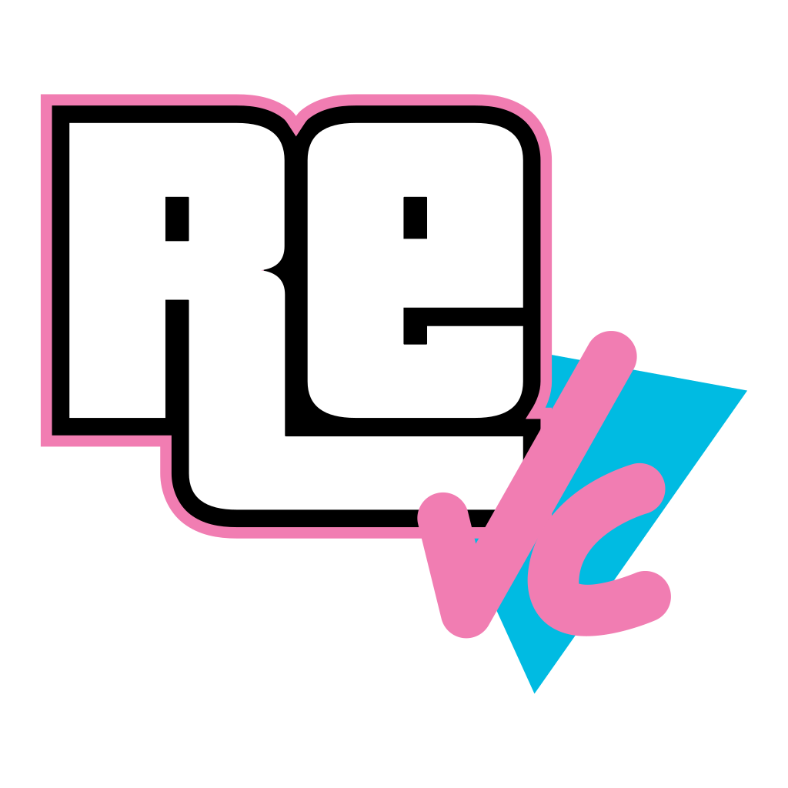

  

# reVC Android

Android port workspace for `reVC`, with the app module, native sources, and bundled third-party dependencies in a single repository.

## Overview

- Android package: `com.wn_klaymen1n.revc`
- Supported ABIs: `armeabi-v7a`, `arm64-v8a`
- Native sources and Android-specific code: `native/`
- SDL source tree: `third_party/SDL/`

## Notes

- SDL is built from source as part of the project.
- The project is based on `re3/reVC`.
- Rights to the original game and related assets belong to Rockstar Games and their respective owners.

## License

No license is provided for this repository.
Use it for education, documentation, and modding purposes only.
Do not use it for piracy or commercial distribution.
